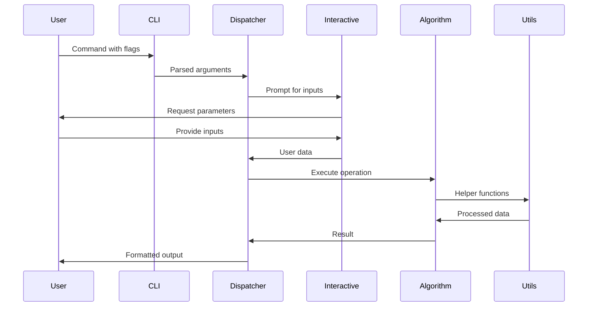

<div align="center">
  

# RusCrypt

### _⚡ Lightning-fast cryptography toolkit built with Rust ⚡_


[](https://github.com/Adel2411/ruscrypt)
[](https://github.com/Adel2411/ruscrypt)

**Modern cryptographic operations made simple and blazingly fast**

[📖 Documentation](#-documentation) • [🚀 Quick Start](#-quick-start) • [💡 Examples](#-examples) • [🤝 Contributing](#-contributing) • [📚 API Docs](https://docs.rs/ruscrypt/0.1.0/ruscrypt/)

</div>

---

## 📑 Table of Contents

- [🎯 Overview](#-overview)
- [✨ Features](#-features)
- [📦 Installation](#-installation)
- [📸 Screenshot](#-screenshot)
- [🚀 Quick Start](#-quick-start)
- [📖 Documentation](#-documentation)
- [💡 Examples](#-examples)
- [🧪 Testing](#-testing)
- [🔒 Security](#-security)
- [🤝 Contributing](#-contributing)
- [📄 License](#-license)

---

## 📸 Screenshot

Below is a screenshot of the interactive usage of `ruscrypt`:


*Example: Interactive help and encryption prompt.*

---

## 🎯 Overview

**ruscrypt** is a powerful command-line cryptography toolkit that brings together classical and modern cryptographic algorithms in one unified interface. Built with Rust for **maximum performance**, **memory safety**, and **security**.

> 🎓 **Perfect for**: Learning cryptography, educational purposes, quick encryption tasks, and understanding algorithm implementations.

### Why ruscrypt?

| Feature             | Description                                              |
| ------------------- | -------------------------------------------------------- |
| ⚡ **Blazing Fast** | Rust's zero-cost abstractions ensure optimal performance |
| 🔒 **Memory Safe**  | No buffer overflows or memory leaks                      |
| 🎯 **Simple API**   | One command format for all algorithms                    |
| 📚 **Educational**  | Clean implementations perfect for learning               |
| 🔧 **Interactive**  | Guided prompts for all required parameters               |

---

## ✨ Features

<div align="center">

| 🏛️ **Classical Ciphers** | 🔐 **Stream & Block Ciphers** | 🔑 **Asymmetric Encryption** | 🔢 **Hash Functions** |
| :----------------------: | :---------------------------: | :--------------------------: | :-------------------: |
|      Caesar Cipher       |              RC4              |             RSA              |          MD5          |
|     Vigenère Cipher      |         AES (128/192/256)         |        Diffie-Hellman        |         SHA-1         |
|     Playfair Cipher      |         DES (ECB/CBC)         |              -               |        SHA-256        |
|    Rail Fence Cipher     |         AES (ECB/CBC)         |              -               |           -           |

</div>

---

## 🏗️ Architecture Overview

The RusCrypt toolkit follows a modular architecture designed for extensibility and maintainability

### Data Flow Architecture



---

## 🏗️ Project Structure

```
ruscrypt/
├── Cargo.toml                  # Project manifest
├── README.md                   # Documentation
├── src/
│   ├── main.rs                 # Entry point
│   ├── lib.rs                  # Library exports
│   ├── cli.rs                  # CLI parsing
│   ├── dispatcher.rs           # Command routing
│   ├── interactive.rs          # User prompts
│   ├── utils.rs                # Shared utilities
│   │
│   ├── classical/              # Classical ciphers
│   ├── stream/                 # Stream ciphers
│   ├── block/                  # Block ciphers
│   ├── asym/                   # Asymmetric crypto
│   ├── hash/                   # Hash functions
│   └── tests/                  # Test modules
│       ├── mod.rs
│       ├── classical.rs
│       ├── stream.rs
│       ├── block.rs
│       ├── hash.rs
│       ├── asym.rs
```

---

## 📦 Installation

### Prerequisites

- **Rust**: 1.70.0 or higher

### Install from crates.io (Recommended)

```bash
# 📥 Install the CLI tool globally
cargo install ruscrypt

# 🎯 Binary will be available in your PATH
ruscrypt --help
```

### Use as a Library

```bash
# 📚 Add to your Cargo.toml dependencies
cargo add ruscrypt

# Or manually add to Cargo.toml:
# [dependencies]
# ruscrypt = "0.1.0"
```

### Build from Source

```bash
# 📥 Clone the repository
git clone https://github.com/Adel2411/ruscrypt.git
cd ruscrypt

# 🔨 Build in release mode for optimal performance
cargo build --release

# 🎯 Binary will be available at
./target/release/ruscrypt
```

---

## 🚀 Quick Start

### Command Format

```bash
# Show help information (any of these commands):
ruscrypt
ruscrypt --help
ruscrypt <encrypt|decrypt|hash|exchange> --help

# Check version
ruscrypt --version

# For encryption and decryption
ruscrypt <encrypt|decrypt> --<algorithm>

# For hashing operations
ruscrypt hash --<algorithm>

# For key exchange protocols
ruscrypt exchange --<protocol>
```

### Interactive Experience

All operations are **interactive** - the tool will prompt you for required inputs:

```bash
# Example: Caesar cipher encryption
$ ruscrypt encrypt --caesar
Enter text to encrypt: Hello World
Enter shift value (1-25): 3
Encrypted text: Khoor Zruog

# Example: AES encryption
$ ruscrypt encrypt --aes
Enter text to encrypt: Secret message
Enter password: ********
Select AES key size: 256
Select encryption mode: CBC
Select output encoding: base64
Encrypted text: [base64 encoded result]

# Example: SHA-256 hashing
$ ruscrypt hash --sha256
Enter text to hash: password123
SHA-256 hash: ef92b778bafe771e89245b89ecbc08a44a4e166c06659911881f383d4473e94f
```

---

## 📖 Documentation

### Algorithm Reference

#### 🏛️ Classical Ciphers

<details>
<summary><strong>Caesar Cipher</strong> - Simple substitution cipher</summary>

```bash
# Encrypt
ruscrypt encrypt --caesar
# Prompts:
# - Text to encrypt
# - Shift value (1-25)

# Decrypt
ruscrypt decrypt --caesar
# Prompts:
# - Text to decrypt
# - Shift value (1-25)
```

**How it works**: Each letter is shifted by a fixed number of positions in the alphabet.

</details>

<details>
<summary><strong>Vigenère Cipher</strong> - Polyalphabetic substitution</summary>

```bash
# Encrypt
ruscrypt encrypt --vigenere
# Prompts:
# - Text to encrypt
# - Keyword

# Decrypt
ruscrypt decrypt --vigenere
# Prompts:
# - Text to decrypt
# - Keyword
```

**How it works**: Uses a keyword to shift letters by varying amounts.

</details>

<details>
<summary><strong>Playfair Cipher</strong> - Digraph substitution</summary>

```bash
# Encrypt
ruscrypt encrypt --playfair
# Prompts:
# - Text to encrypt
# - Keyword for matrix

# Decrypt
ruscrypt decrypt --playfair
# Prompts:
# - Text to decrypt
# - Keyword for matrix
```

**How it works**: Encrypts pairs of letters using a 5x5 key matrix.

</details>

<details>
<summary><strong>Rail Fence Cipher</strong> - Transposition cipher</summary>

```bash
# Encrypt
ruscrypt encrypt --railfence
# Prompts:
# - Text to encrypt
# - Number of rails (2-10)

# Decrypt
ruscrypt decrypt --railfence
# Prompts:
# - Text to decrypt
# - Number of rails (2-10)
```

**How it works**: Text is written in a zigzag pattern across multiple rails.

</details>

#### 🔐 Stream & Block Ciphers

<details>
<summary><strong>RC4</strong> - Stream cipher</summary>

```bash
# Encrypt
ruscrypt encrypt --rc4
# Prompts:
# - Text to encrypt
# - Key (variable length)
# - Output encoding (base64/hex)

# Decrypt
ruscrypt decrypt --rc4
# Prompts:
# - Text to decrypt
# - Key (same as encryption)
# - Input encoding (base64/hex)
```

**Note**: Legacy algorithm, use for educational purposes only.

</details>

<details>
<summary><strong>AES</strong> - Advanced Encryption Standard</summary>

```bash
# Encrypt
ruscrypt encrypt --aes
# Prompts:
# - Text to encrypt
# - Password
# - Key size (128/192/256)
# - Mode (ECB/CBC)
# - Output encoding (base64/hex)

# Decrypt
ruscrypt decrypt --aes
# Prompts:
# - Text to decrypt
# - Password (same as encryption)
# - Key size (same as encryption)
# - Mode (same as encryption)
# - Input encoding (same as encryption)
```

**Security**: Industry-standard symmetric encryption.

</details>

<details>
<summary><strong>DES</strong> - Data Encryption Standard</summary>

```bash
# Encrypt
ruscrypt encrypt --des
# Prompts:
# - Text to encrypt
# - Key (exactly 8 characters)
# - Mode (ECB/CBC)
# - Output encoding (base64/hex)

# Decrypt
ruscrypt decrypt --des
# Prompts:
# - Text to decrypt
# - Key (same as encryption)
# - Mode (same as encryption)
# - Input encoding (same as encryption)
```

**Note**: Legacy algorithm, use for educational purposes only.

</details>

#### 🔑 Asymmetric Encryption

<details>
<summary><strong>RSA</strong> - Rivest-Shamir-Adleman</summary>

```bash
# Encrypt
ruscrypt encrypt --rsa
# Prompts:
# - Text to encrypt
# - Key size (512/1024/2048)
# - Output encoding (base64/hex)
# Tool generates key pair automatically

# Decrypt
ruscrypt decrypt --rsa
# Prompts:
# - Text to decrypt
# - Private key (format: n:d)
# - Input encoding (base64/hex)
```

**Use case**: Small data encryption and digital signatures.

</details>

<details>
<summary><strong>Diffie-Hellman</strong> - Key Exchange</summary>

```bash
# Key exchange operations
ruscrypt exchange --dh
# Options:
# - Interactive Simulation (Alice & Bob)
# - Manual Exchange - Start Session
# - Manual Exchange - Complete with Other's Key
# - Mathematical Concept Demo
```

**Use case**: Secure key exchange demonstration.

</details>

#### 🔢 Hash Functions

<details>
<summary><strong>MD5</strong> - Message Digest 5</summary>

```bash
ruscrypt hash --md5
# Prompts:
# - Text to hash
# Output: 32-character hexadecimal hash
```

**Note**: Cryptographically broken, use only for compatibility.

</details>

<details>
<summary><strong>SHA-1</strong> - Secure Hash Algorithm 1</summary>

```bash
ruscrypt hash --sha1
# Prompts:
# - Text to hash
# Output: 40-character hexadecimal hash
```

**Note**: Deprecated, use only for legacy compatibility.

</details>

<details>
<summary><strong>SHA-256</strong> - Secure Hash Algorithm 256</summary>

```bash
ruscrypt hash --sha256
# Prompts:
# - Text to hash
# Output: 64-character hexadecimal hash
```

**Recommended**: Use for all new applications requiring hashing.

</details>

---

## 💡 Examples

### Classical Cipher Examples

```bash
# 🏛️ Caesar cipher example
$ ruscrypt encrypt --caesar
Enter text to encrypt: HELLO WORLD
Enter shift value (1-25): 5
Encrypted text: MJQQT BTWQI

$ ruscrypt decrypt --caesar
Enter text to decrypt: MJQQT BTWQI
Enter shift value (1-25): 5
Decrypted text: HELLO WORLD

# 🏛️ Vigenère cipher example
$ ruscrypt encrypt --vigenere
Enter text to encrypt: ATTACKATDAWN
Enter keyword: LEMON
Encrypted text: LXFOPVEFRNHR
```

### Modern Encryption Examples

```bash
# 🔐 AES encryption example
$ ruscrypt encrypt --aes
Enter text to encrypt: This is a secret message
Enter password: mySecurePassword123
Select AES key size: 256
Select encryption mode: CBC
Select output encoding: base64
Encrypted text (AES-256, CBC, base64): U2FsdGVkX1+vupppZksvRf5pq5g5XjFRlipRkwB0K1Y96Qsv2Lm+31cmzaAILwyt

# 🔐 RSA encryption example
$ ruscrypt encrypt --rsa
Enter text to encrypt: Hello RSA
Select RSA key size: 1024
Select output encoding: base64

🔐 RSA Encryption Complete!
📤 Encrypted data: SGVsbG8gUlNB...
🔑 Private key (SAVE THIS!): 12345678:98765432
⚠️  Keep your private key secure - you'll need it for decryption!
```

### Hash Function Examples

```bash
# 🔢 Hash function examples
$ ruscrypt hash --sha256
Enter text to hash: password123
SHA-256 hash: ef92b778bafe771e89245b89ecbc08a44a4e166c06659911881f383d4473e94f

$ ruscrypt hash --md5
Enter text to hash: hello world
MD5 hash: 5d41402abc4b2a76b9719d911017c592

$ ruscrypt hash --sha1
Enter text to hash: test
SHA-1 hash: a94a8fe5ccb19ba61c4c0873d391e987982fbbd3
```

### Key Exchange Example

```bash
# 🔑 Diffie-Hellman key exchange
$ ruscrypt exchange --dh
Select Diffie-Hellman operation: Interactive Simulation (Alice & Bob)

🔑 Diffie-Hellman Key Exchange Simulation
==========================================

👩 Alice (You):
  Prime (p):     2147483647
  Generator (g): 2
  Private key:   12345 (keep secret!)
  Public key:    987654321 (share with Bob)

👨 Bob (Simulated):
  Private key:   67890 (Bob keeps secret)
  Public key:    123456789 (Bob shares with you)

🤝 Key Exchange Result:
  Alice computed shared secret: 555666777
  Bob computed shared secret:   555666777
  ✅ SUCCESS: Both parties have the same shared secret!
```

---

## 🧪 Testing

### Run Test Suite

```bash
# 🧪 Run all tests
cargo test

# ⚡ Run specific test files
cargo test classical      # Test classical ciphers
cargo stream        # Test stream ciphers  
cargo block         # Test block ciphers
cargo hash          # Test hash functions
cargo asym          # Test asymmetric crypto

# 🎯 Run specific algorithm tests
cargo caesar_tests        # Test Caesar cipher
cargo vigenere_tests      # Test Vigenère cipher
cargo aes_tests          # Test AES encryption
cargo rsa_tests           # Test RSA encryption
cargo sha256_tests        # Test SHA-256 hashing
cargo dh_tests            # Test Diffie-Hellman
```

### Manual Testing

Test each algorithm interactively:

```bash
# Check available commands
ruscrypt --help

# Test classical ciphers
ruscrypt encrypt --caesar
ruscrypt encrypt --vigenere
ruscrypt encrypt --playfair
ruscrypt encrypt --railfence

# Test stream & block ciphers
ruscrypt encrypt --rc4
ruscrypt encrypt --aes
ruscrypt encrypt --des

# Test asymmetric encryption
ruscrypt encrypt --rsa
ruscrypt exchange --dh

# Test hash functions
ruscrypt hash --md5
ruscrypt hash --sha1
ruscrypt hash --sha256
```

---

## 🔒 Security

### ⚠️ Important Security Considerations

| ⚠️ **Warning**           | **Description**                                                  |
| ------------------------ | ---------------------------------------------------------------- |
| 🎓 **Educational Use**   | This tool is designed for learning and experimentation           |
| 🚫 **Legacy Algorithms** | RC4, DES, MD5, and SHA-1 are **NOT secure** for modern use       |
| 🚫 **Classical Ciphers** | All classical ciphers are **NOT secure** for real-world use      |
| 🔑 **Interactive Input** | Passwords are entered visibly - use only for testing             |
| 🏭 **Production Use**    | Use AES and RSA with proper key management for real applications |

### 🛡️ Recommended Algorithms

```bash
# ✅ Secure for modern use
ruscrypt encrypt --aes      # Symmetric encryption (AES-256, CBC mode)
ruscrypt encrypt --rsa      # Asymmetric encryption (2048+ bit keys)
ruscrypt hash --sha256      # Cryptographic hashing

# ❌ Educational/legacy only
ruscrypt encrypt --caesar   # Easily broken
ruscrypt encrypt --des      # 56-bit key, deprecated
ruscrypt encrypt --rc4      # Known vulnerabilities
ruscrypt hash --md5         # Collision attacks possible
ruscrypt hash --sha1        # Deprecated by NIST
```

### 🔐 Key Management Best Practices

- **AES**: Use strong passwords (12+ characters, mixed case, numbers, symbols)
- **DES**: Use exactly 8 characters as required by the algorithm
- **RSA**: Use 2048+ bit keys for real applications (512/1024 for education only)
- **RC4**: Use random keys of appropriate length

---

## 🤝 Contributing

We welcome contributions! Here's how to get started:

### 🚀 Quick Contribution Guide

1. **🍴 Fork** the repository
2. **🌿 Create** a feature branch:
   ```bash
   git checkout -b feature/new-algorithm
   ```
3. **✨ Make** your changes
4. **🧪 Test** thoroughly:
   ```bash
   cargo test
   cargo clippy
   cargo fmt
   ```
5. **📝 Commit** and create a Pull Request

### 🎯 Contribution Areas

| Area                    | Description                   | Difficulty |
| ----------------------- | ----------------------------- | ---------- |
| 🔐 **New Algorithms**   | Implement additional ciphers  | 🟡 Medium  |
| 🎨 **CLI Improvements** | Better interactive experience | 🟢 Easy    |
| 📚 **Documentation**    | Examples and guides           | 🟢 Easy    |
| 🧪 **Testing**          | More comprehensive tests      | 🟡 Medium  |

### 🔧 Development Setup

```bash
# Clone and setup
git clone https://github.com/Adel2411/ruscrypt.git
cd ruscrypt

# Install dependencies
cargo build

# Run tests
cargo test

# Format code
cargo fmt

# Check for issues
cargo clippy
```

---

## 📄 License

This project is licensed under the **MIT License** - see the [LICENSE](LICENSE) file for details.

---

<div align="center">

## 🌟 Show Your Support

If you find **ruscrypt** useful, please consider:

[](https://github.com/Adel2411/ruscrypt)

---

**Created with ❤️ by [Adel2411](https://github.com/Adel2411)**

[](https://github.com/Adel2411)

#### _Built with Rust 🦀 • Secured with Math 🔢 • Crafted with Passion 💎_

</div>
